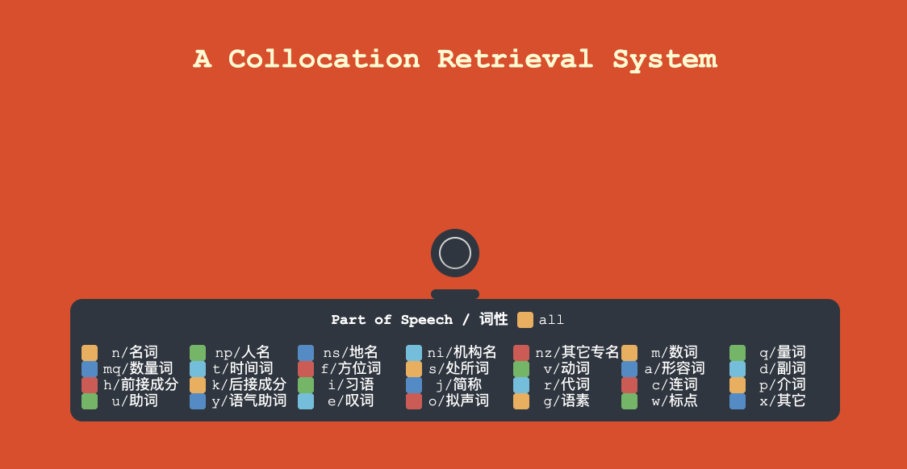

# Collocation Retrieval 中文搭配检索

陈伟浩，2016013288





## 完成功能

本作业完成了一个中文搭配检索系统，其特点及功能如下：

- 大规模数据：本检索系统所收录的数据为SogouT数据中的一部分，具体索引的数据文件包括：`Sogou_0000`、`Sogou_0001`、`Sogou_0002`、`Sogou_0010`、`Sogou_0011`、`Sogou_0012`，共有218669988行数据（文档数），索引+数据共有32.5G
- 完成给定检索词，查询出其常见搭配，并支持：
  - 同时给定多个检索词（空格分隔）
  - 指定返回候选词的词性
  - 指定返回候选词在文本中与检索词的距离（窗口大小）
- 基于命令行的交互界面，支持动态调整：候选词词性、窗口大小、返回结果数量
- 完成web图形交互界面


## 实现细节

1. 使用THULAC进行中文分词和词性标注

   已在前期完成，处理代码见`src-thulac/main.cpp`。

2. 使用PyLucene库，以Lucene作为检索框架建立索引

   将语料文件的每一行作为一篇文档，使用Lucene框架对文档和词频（term frequency）进行索引，代码见`src/gen_index.py`。

3. 基于Lucene索引进行检索及结果优化

   - 先调用Lucene的`IndexSearcher`的`search`方法来获取评分最高的n篇文档`TopDocs`，即n行最接近查询的数据。这里Lucene的评分（score）机制中利用了词频信息，采用TF-IDF对文档进行加权打分。
   - 然后逐个考察选出的文档，先找到检索词在文档中的位置，然后统计其上下文窗口范围内的词，将所有词按词频降序排列；这一步同时要筛掉标点和停止词。
     - 标点、阿拉伯数字，以及“是”、“的”等常见的无信息量的搭配，是有必要筛除的，否则他们将在结果列表中非常靠前的位置。
   - 最后将结果列表中与检索词一模一样的词去除。
     - 之所以没有在前一步直接筛掉与检索词距离为0的词，是因为考虑到，例如当用户搜索“解放”时，Lucene索引查表得到的可能是“解放军”所在的位置，而“解放军”是一个合理的结果，不应该被筛除。所以在最后一步特殊去掉结果中与检索词一模一样的词，此处即为删掉“解放”（从而保留了“解放军”）。

   代码见`src/main.py`。

4. 基于Flask完成Web交互界面

   代码见`src-flask`文件夹。


## 效果评估

### 单检索词

#### 检索：学习

键入检索字符串“学习”，在上下文窗口为5的情况下，得到的前20个结果如下：

```
方法     		    名词
学习型     		    形容词 名词
习惯     		    动词 名词
学生     		    名词
方式     		    名词
自主     		    动词
能力     		    名词
终身     		    名词
中     		    方位词
学习者     		    名词
合作     		    动词
兴趣     		    名词
内容     		    名词
学会     		    名词 动词
提高     		    动词
态度     		    名词
探究     		    动词
组织     		    动词 名词
成绩     		    名词
主动     		    形容词
```

可以发现结果为与“学习”搭配的词语。

若限定为形容词，则结果为：

```
主动     		    形容词
科学     		    形容词
被动     		    形容词
努力     		    形容词
独立     		    形容词
新     		    形容词
全     		    形容词
不错     		    形容词
刻苦     		    形容词
快乐     		    形容词
远程     		    形容词
浓厚     		    形容词
正确     		    形容词
统一     		    形容词
系统     		    形容词
苦     		    形容词
累     		    形容词
接受式     		    形容词
差     		    形容词
强     		    形容词
```

则放回的结果均可以搭配在学习之前或之后。

#### 检索：清华

键入检索字符串“清华”，在上下文窗口为5的情况下，得到的前20个结果如下：

```
清华大学     		    机构名
同方     		    其它专名
紫光     		    名词 其它专名
清华园     		    简称 地名
提供     		    动词
图片     		    名词
评测     		    动词
北大     		    简称
介绍     		    动词
科技园     		    名词
报价     		    动词
液晶     		    名词
控股     		    动词
无线     		    形容词
MP4     		    其它
学院     		    名词
北京     		    地名
价格     		    名词
水木清华     		    习语
教育     		    动词
```

结果基本均为清华周边概念。

若限定为形容词，则结果为：

```
无线     		    形容词
锋锐     		    形容词
精彩     		    形容词
热     		    形容词
最新     		    形容词
原     		    形容词
实     		    形容词
副     		    形容词
高级     		    形容词
正式     		    形容词
大全     		    形容词
紫     		    形容词
常务     		    形容词
最佳     		    形容词
少     		    形容词
厚     		    形容词
国立     		    形容词
低调     		    形容词
豪华     		    形容词
骄傲     		    形容词
```

则结果与清华相关且为形容词，但是结果的含义较为杂乱。

若限定为动词，则结果为：

```
提供     		    动词
评测     		    动词
介绍     		    动词
报价     		    动词
控股     		    动词
教育     		    动词
购买     		    动词
说     		    动词
毕业     		    动词
超     		    动词
进     		    动词
更名     		    动词
位于     		    动词
想     		    动词
查询     		    动词
发展     		    动词
合作     		    动词
成立     		    动词
开发     		    动词
建立     		    动词
```

动词的结果与商业相关度大于与教育的相关度，猜测与语料有一定关系。

若限定为名词，则结果为：

```
图片     		    名词
科技园     		    名词
液晶     		    名词
学院     		    名词
价格     		    名词
光盘片     		    名词
学校     		    名词
世界     		    名词
特性     		    名词
笔记本     		    名词
公司     		    名词
校长     		    名词
参数     		    名词
价     		    名词
有限公司     		    名词
学堂     		    名词
学生     		    名词
专业     		    名词
学子     		    名词
品牌     		    名词
```

同样的，名词的结果与商业相关度大于与教育的相关度，猜测与语料有一定关系。

观察得结果与清华均有较高的相关度，并且具有[实现细节](#实现细节)中已经提到的特点：虽然THULAC分词时把“清华”和“清华大学”分成两个不同的词，但本检索系统能够从“清华”把“清华大学”检索出来。

### 比较不同窗口大小的结果

搜索“北大”，不限制窗口的前20个结果为：

```
北京     		    地名
大学     		    名词
北京大学     		    机构名
青鸟     		    其它专名 名词
清华     		    简称
中国     		    地名
学院     		    名词
人大     		    简称
北大荒     		    地名
北师大     		    简称
北     		    方位词
集团     		    名词
公司     		    名词
北航     		    简称
附中     		    简称
无线     		    形容词
科技     		    名词
方正     		    其它专名
0年     		    时间词
高科     		    简称
```

限制窗口为7的结果为：

```
青鸟     		    其它专名 名词
清华     		    简称
北京     		    地名
北大荒     		    地名
集团     		    名词
北京大学     		    机构名
无线     		    形容词
方正     		    其它专名
高科     		    简称
人大     		    简称
附中     		    简称
资源     		    名词
公司     		    名词
大学     		    名词
北大西洋     		    地名
教授     		    名词
深圳     		    地名
学生     		    名词
医院     		    名词
学院     		    名词
```

限制窗口为5的结果为：

```
青鸟     		    其它专名 名词
清华     		    简称
北京     		    地名
北大荒     		    地名
集团     		    名词
无线     		    形容词
高科     		    简称
方正     		    其它专名
附中     		    简称
资源     		    名词
北京大学     		    机构名
人大     		    简称
北大西洋     		    地名
深圳     		    地名
医院     		    名词
公司     		    名词
北大街     		    地名
教授     		    名词
学生     		    名词
简称     		    动词
```

限制窗口为3的结果为：

```
青鸟     		    其它专名 名词
北大荒     		    地名
北京     		    地名
高科     		    简称
方正     		    其它专名
资源     		    名词
附中     		    简称
北大西洋     		    地名
清华     		    简称
北大街     		    地名
东门     		    地名 处所词
仓     		    语素
街     		    名词
精神     		    名词
简称     		    动词
文化     		    名词
中关村     		    地名
学生     		    名词
未名     		    其它专名 名词
新街口     		    地名
```

可以发现，随着上下文窗口的尺寸不断减小，检索出的搭配与“北大”的相关度越来越大，一些噪音数据如“0年”被过滤掉。

### 多检索词

#### 检索：清华 北大

取上下文窗口为5，搜索“清华 北大”，得到结果为：

```
清华大学     		    机构名
北京大学     		    机构名
北京     		    地名
考上     		    动词
录取     		    动词
学生     		    名词
考入     		    动词
人大     		    简称
考     		    动词
想     		    动词
清华园     		    地名
附中     		    简称
进     		    动词
大学     		    名词
说     		    动词
学院     		    名词
位于     		    动词
考取     		    动词
中国     		    地名
食堂     		    名词
```

对比之前仅检索“清华”的结果，可以发现加上“北大”之后，检索结果与广大学子梦想考入中国最高学府的含义息息相关，而不是之前检索结果中较多的清华周边概念。

#### 检索：小说 有趣

取上下文窗口为5，检索形容词，搜索“小说 有趣”，得到的结果为：

```
生动     		    形容词
紧     		    形容词
好看     		    形容词
滑稽     		    形容词
有趣哦     		    形容词
幽默     		    形容词
恐怖     		    形容词
新奇     		    形容词
精彩     		    形容词
风趣     		    形容词
真实     		    形容词
好玩     		    形容词
无趣     		    形容词
有名     		    形容词
可爱     		    形容词
新鲜     		    形容词
真     		    形容词
简单     		    形容词
不错     		    形容词
确实     		    形容词
```

同样的条件，仅搜索“小说”，得到：

```
恐怖     		    形容词
在线     		    形容词
最新     		    形容词
原创     		    形容词
灵异     		    形容词
古典     		    形容词
微型     		    形容词
原     		    形容词
优秀     		    形容词
新     		    形容词
超级     		    形容词
热门     		    形容词
悬疑     		    形容词
全     		    形容词
好看     		    形容词
恶     		    形容词
惊险     		    形容词
神秘     		    形容词
麻烦     		    形容词
侠义     		    形容词
```

可以发现仅仅搜索“小说”，得到的形容词各式各样，但是加上“有趣”之后检索出来的更多的形容词偏向“好玩”“风趣”的含义。

#### 检索：道德 楷模

取上下文窗口为5，检索形容词，搜索“道德 楷模”，得到的结果为：

```
高尚     		    形容词
先进     		    形容词
旧     		    形容词
新     		    形容词
优秀     		    形容词
诚实     		    形容词
理想     		    形容词
自觉     		    形容词
文明     		    形容词
诚信     		    形容词
高     		    形容词
光辉     		    形容词
全     		    形容词
守信     		    形容词
知名     		    形容词
幸甚     		    形容词
隆重     		    形容词
女     		    形容词
生动     		    形容词
少     		    形容词
```

同样的条件，仅搜索“道德”，得到：

```
不道德     		    形容词
高尚     		    形容词
新     		    形容词
公共     		    形容词
非道德     		    形容词
旧     		    形容词
自觉     		    形容词
原     		    形容词
高     		    形容词
诚信     		    形容词
完美     		    形容词
外在     		    形容词
封建     		    形容词
理想     		    形容词
正确     		    形容词
日常     		    形容词
原始     		    形容词
非彼道德     		    形容词
内在     		    形容词
努力     		    形容词
```

同样的条件，仅搜索“楷模”，得到：

```
新     		    形容词
骄傲     		    形容词
人为     		    形容词
诚信     		    形容词
完美     		    形容词
先进     		    形容词
廉洁     		    形容词
节俭     		    形容词
幸福     		    形容词
理想     		    形容词
高尚     		    形容词
光荣     		    形容词
刚直     		    形容词
清廉     		    形容词
长寿     		    形容词
正直     		    形容词
科学     		    形容词
好样     		    形容词
特等     		    形容词
流行业     		    形容词
```

同样可以发现，在多个检索词的共同作用下，的确可以做到精准搜索想要的搭配。

### 分词对检索效果的影响

如果不分词，则会对语料库及查询字符串进行按字拆分，此时得到的搭配一定是以字为单位的。这样的弊端至少有两个：

1. 窗口大小不同，得到的返回结果可能会因被截断而成为无含义的词；
2. 检索的字符串被打乱，多个检索词在一起没有加强精准搜素的效果。